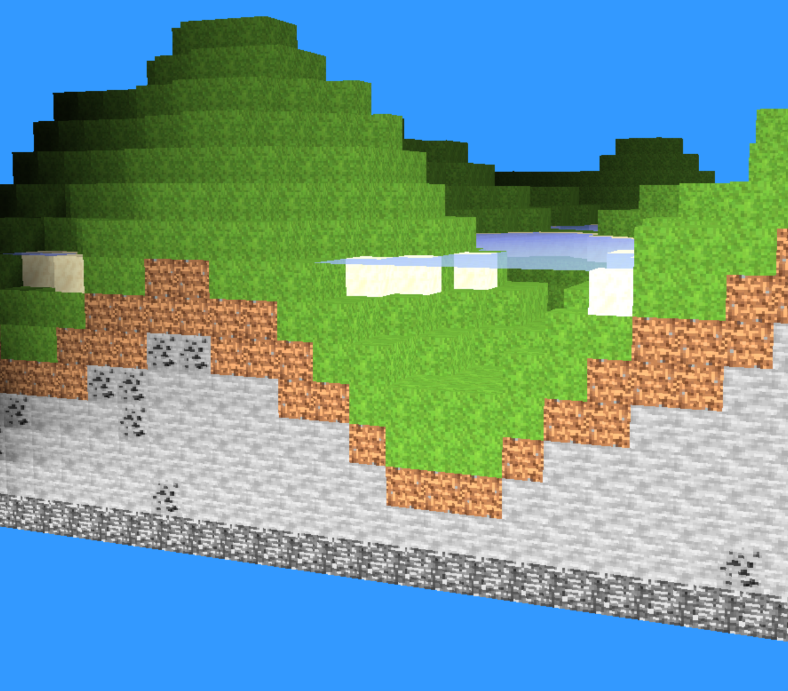

# Minecraft Shaders implementation in C++

This is a first approach at creating a minecraft like world in C++ with the use of the OpenGL API.

## Requirements

- GLFW 3.3.2
- OpenGL 4.6
- glm
- stbImage


On Debian-based systems like Ubuntu, you can install glfw using :

`sudo apt-get install libglfw3-dev libgl1-mesa-dev`


On Windows, you can use vcpkg or download the libraries from their respective websites and specify the paths in CMakeLists.txt.

On macOS, you can use Homebrew :

```brew install glfw```

## Build
```bash
mkdir build
cd build
cmake ..
make
./Minecraft
```

## Controls (QWERTY)

- WASD to move
- R or SHIFT to move faster
- ESCAPE to climb
- Q to descend
- X to change to wireframe
- G to enable/disable freefall
- Left Click to break block
- J to set/unset to day


## Screenshots



## References

## License
[MIT](https://choosealicense.com/licenses/mit/)

## Author
- [Scott TALLEC](https://github.com/TALLEC-Scott)
- [Justin JAECKER](https://github.com/Justinj68)
